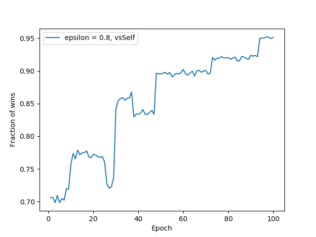

# TapnSwap - Reinforcement Learning

### Jean-Remy Conti, ENS Paris-Saclay (France), 2020


This a personal project I did during the COVID-19 pandemic. It is based on a game I would often play with friends. An optimal policy is learned via Q-learning and the user may play against the trained agent (difficult level choice).


<p align="center">
  
</p>

## Requirements

* Python
* Python basic libraries: numpy, os, time, matplotlib.


## Run the game 

Clone this repository and run `main.py`.

```
git clone https://github.com/JRConti/TapnSwap-RL
python TapnSwap-RL/main.py
```

The file `main.py` launches the game only, not the training part.

When playing in 1-player mode, the (very) easy level makes you play against a fully Random Agent while the difficult level makes you play against an agent trained by Q-learning.

The code for the game has been written (and tested) for Linux; there might be some problems with other OS even if the requirements are basic, so let me know if you encounter bugs by submitting an issue.


## Structure of repository

* `tapnswap.py`: back-end
* `interact.py`, `main.py`: front-end
* `agent.py`: defines the agent's behavior
* `train.py`, `validation.py`: training and optimization
* `Models`: saved Q-functions of different models with:
    * `Models/data`: saved counters of state-action pairs for each agent
    * `Models/train`: testing results of agents during training
    * `Models/results`: tournament reports between trained agents
* `doc`: source LaTeX code for `README.pdf`
* `images`: contains 2 sampled images.


## Description of the game

You may skip this part if you want to play: the rules of the game are explained to you when launching the game.

TapnSwap is a 2-player game. Both players have a variable number of fingers on both of their hands. If one player has a hand composed of more than 4 fingers, this hand is "killed". The goal of the game is to kill both hands of the opponent player.

#### First round

Each player starts with 1 finger on each hand and one of them has to make the first move. The configuration of hands is then:

` Round of Player 1 `

                Player 2                
                   |                    
               |   |   |                
                   |                    
        L -------------------- R        
                   |                    
               |   |   |                
                   |                    
                Player 1  

Both players are separated from each other by the horizontal line. The main vertical line separates the hands of both players (L: left hands, R: right hands). There is currently 1 finger on each hand of each player.

#### Actions

At each round of the game, each player has to choose an action among the list of possible actions. There are 2 main kinds of actions: tap and swap.

* Tap actions involve adding the number of fingers on one of your hands to one of your opponent's hands.

For instance, with the previous initial configuration, Player 1 may tap only with 1 (both of Player 1's hands have 1 finger) on 1 (both of Player 2's hands have 1 finger). If it happens, the configuration of hands at the next round is then:

`Round of Player 2`

                Player 1                
                   |                    
               |   |   |                
                   |                    
        L -------------------- R        
                   |                    
              ||   |   |                
                   |                    
                Player 2                

Player 2 had 1 finger on each hand but Player 1 tapped with 1 so now Player 2 has one hand with 1+1 = 2 fingers.

Now let's consider a more complex example:

`Round of Player 1`

                Player 2                
                   |                    
              ||   |   ||||             
                   |                    
        L -------------------- R        
                   |                    
             |||   |   |                
                   |                    
                Player 1                

It is Player 1's round. Her hands have respectively 3 and 1 fingers while Player 2 has hands with 2 and 4 fingers. Player 1 can then tap with 3 or 1 on a hand of Player 2, that is on 2 or 4.

Player 1 is able to kill the hand of Player 2 with 2 fingers, by tapping with 3 on 2 (3+2 = 5 > 4). The next round is then:

`Round of Player 2`

                Player 1                
                   |                    
             |||   |   |                
                   |                    
        L -------------------- R        
                   |                    
                   |   ||||             
                   |                    
                Player 2                

Now Player 2 has lost a hand. Notice that Player 1 could have killed the hand of Player 2 which has 4 fingers instead, in the same way.

* Swap actions consist in exchanging some fingers of one of your hand to the other one.

To illustrate this process, let's come back to the previous complex example:

`Round of Player 1`

                Player 2                
                   |                    
              ||   |   ||||             
                   |                    
        L -------------------- R        
                   |                    
             |||   |   |                
                   |                    
                Player 1                

Instead of tapping with 1 or 3, Player 1 may swap some fingers from one of her hands to the other. By swapping 1 finger, Player 1 can obtain the configuration of hands 2-2 or 4-0. Let's look at the first possibility:

`Round of Player 1`

                Player 2                
                   |                    
              ||   |   ||||             
                   |                    
        L -------------------- R        
                   |                    
              ||   |   ||               
                   |                    
                Player 1                

By swapping, Player 1 gets the configuration of hands 2-2. Changing the hand that loses 1 finger, Player 1 could have obtained the configuration 4-0.

There is one main restriction to swap actions: swapping to an identical but reversed configuration is NOT allowed. For instance, in this case, Player 1 could not have swapped from 3-1 to 1-3, exchanging 2 fingers.

But it is still possible to exchange 2 fingers. For instance, a swap from 3-2 to 1-4 is a valid swap.

Note that it is also possible to revive a killed hand:

`Round of Player 1`

                Player 2                
                   |                    
              ||   |   |                
                   |                    
        L -------------------- R        
                   |                    
              ||   |                    
                   |                    
                Player 1                

In this case, Player 1 has one hand with 2 fingers and a killed hand. Exchanging 1 finger from the left to the right, Player 1 may revive the killed hand:

`Round of Player 1`

                Player 2                
                   |                    
              ||   |   |                
                   |                    
        L -------------------- R        
                   |                    
               |   |   |                
                   |                    
                Player 1                

That's all for the rules !


The code for the game can be found in:
1. `tapnswap.py`: back-end.
2. `interact.py`: utils functions for front-end.
3. `main.py`: front-end.


## Training and results

<<<<<<< HEAD
For details on the implementation, how the training is modeled, the experiments I have achieved alongside the corresponding results, see `README.pdf` file in this repo.
=======
The training of the agent is done via Q-learning, which is a specific kind of Reinforcement Learning algorithm. In classical Reinforcement Learning, an agent evolves in an environment in the following way: starting from an intial state , the agent chooses an action , the environment responds to the agent by giving its new state  and a reward . The same process keeps going for next time steps. At time step , the agent is in state , chooses action  and gets its next state  and the corresponding reward  by the environment. 

#### The agent and the environment

In a 2-player game like TapnSwap, the agent is one player that should learn the optimal policy (or strategy). The environment is the entity that is impacted by the agent's actions and that responds to the agent by giving its new states and rewards. One trivial choice for the environment is the agent's opponent.

#### Current state 

The current state of the agent is a list of 2-sized lists containing the number of fingers of each hand. For instance, if the current configuration is:


`Round of Agent`

            Agent's opponent                
                   |                    
              ||   |   ||||             
                   |                    
        L -------------------- R        
                   |                    
             |||   |   |                
                   |                    
                 Agent                

the current state of the agent is `[[3,1], [2,4]]`. Note that the lists are firstly (agent then opponent) and secondly ordered (left hand then right hand). The initial state  is `[[1,1], [1,1]]`.

#### Action 

Actions in back-end (file `tapnswap.py`) are represented differently depending on whether they are tap or swap actions.

Tap actions are coded as `[0, tapping_hand, tapped_hand]` where `tapping_hand` is the hand of the agent involved in tap action (0: left hand, 1: right hand) and `tapped_hand` is the hand of the agent's opponent that receives the tap action from the agent (same binary coding).

Swap actions are coded as `[1, giving_hand, exchange_nbr]` where `giving_hand` is the hand of the agent that gives some of its fingers to the other hand (same binary coding as before) and `exchange_nbr` is the amount of such fingers.

In file `agent.py`, the agent initializes itself by creating an integer coding for all the actions in the previous format. At each time step, the agent gets the list of possible actions, code them in integers, chooses between them and send the decoded chosen action to back-end.

#### Next state 

The next state of the agent is given by the environment after that the agent chooses the action . It is the configuration of hands obtained after the round of the agent's opponent which follows action .

#### Reward 

The most difficult task in Reinforcement Learning is often determining the rewards corresponding to each transition (, , ). In this game, it is difficult to find such rewards without adding bias to the learning process (which may not be optimal). Indeed, the sole purpose of killing 1 hand might not even be an optimal strategy at all ... Thus, I chose to give non-zero rewards to the agent if and only if the game came to an end (positive reward if game is won, negative reward if game is lost). 

#### RL

The agent's actions are determined by its policy  (such that ) which depends only on the current state. For 1 game ending at  and starting at state , the goal of the agent is to maximize the following quantity w.r.t. :


It is the expected sum of rewards the agent gets starting at , following policy \pi. In this case, the expectation is on the new states  given by the environment. The factor gamma gives the significance of first actions over last ones. The optimal policy  has value  for all initial states.

#### Q-learning

The Q-function is defined similarly:


This algorithm approximates the optimal Q-function . Note that the optimal policy is then given by  where  is the set of possible actions at time .

The main idea of Q-learning is to build an estimator  of the optimal Q-function . At the beginning, the agent is initialized with a full-zero matrix  for all states  and all actions . Note that, in our case, we are in tabular setting (the number of distinct state-action pairs can be stored in the memory of a computer) so there is no need of Deep Learning. As one can observe from the definitions of states and actions for TapnSwap, there are 5^4 - 1 = 624 distinct states (the -1 is because the state `[[0,0], [0,0]]` is not possible) and 2^2 (tap) + 2 * 2 (all swap actions can be described with 1 or 2 exchanged fingers only) = 8 distinct actions. Thus, the estimator  is a matrix of size 624 * 8.

The training consists in the agent playing  games. For each game, the agent starts at state  and, while the game is not over, it takes action  at state  with -greedy policy (probability  of taking action randomly and  of taking current optimal actions ), observes next state  and reward . It then computes the Temporal Difference (TD(0)):


 is an unbiased estimator of the Bellman error, which quantifies how far the estimator  is from the optimal Q-function . Thus, a simple way to minimize this error is to update the estimator  at each time step in the following way:

.

 is the learning rate and should depend on the current state-action pair. Q-learning converges a.s. to the optimal Q-function if all state-action pairs are tried infinitely often with the learning rate satisfying Robbins-Monro conditions: I chose in this case  where  is the number of visits of the state-action pair (, ) from the agent. The decisions of the agent and the updates of the estimator  are coded in file `agent.py`.

The whole process is repeated until the game is over, and for  games. At the end, the near-optimal policy is .

An agent is thus fully determined by the pair (, ) used during training. Note that  controls the trade-off between exploitation and exploration. 

#### The agent's opponent

The opponent is a significant feature for training as it is the environment in which the agent evolves. In file `train.py`, I implemented 2 different ways of training for an agent: playing against a fully Random Agent or playing against another version of itself. 

Note that usually, Q-learning is an off-policy method, meaning that the agent should adopt an -greedy policy. However, firstly because of flexibility and secondly because of the influence of  on the environment (when an agent plays against another version of itself), I chose to allow training for any value of .

#### Training in practice

In file `train.py`, I implemented a training function that allows to train any agent (determined by  and ) during the number of games (or epochs) you want, either vsRandom (fully Random Agent opponent) or vsSelf (playing against another version of itself). At the end of training, the function saves the learned Q-function in a CSV format located at `Models/filename.csv`. The typo for `filename` I used can be illustrated with an example: the file `Models/greedy_0_1_vsRandom.csv` stores the Q-function of an agent with  training against a Random Agent while the file `Models/greedy_0_4_vsSelf.csv` stores the Q-function of an agent with  training against another version of itself. 

Note that  is not specified in the name of the CSV file because it is not a relevant parameter in our case. Indeed, since the only reward is at the end of the game, there is no need to weight some rewards compared to others.

The previous training function also stores the counter of state-action pairs encountered by an agent during training. For the latter example, the counter is stored at `Models/data/count_greedy_0_4_vsSelf.csv`.

Thus, I allowed the possibility of training an already trained model, importing the learned Q-function and the counter of encountered state-action pairs. It is also possible for the user to play on the shell with the learning agent DURING training as often as you want. In the same way, I allowed for a learning agent the possibility to play any number of games (without training on those) against a fully Random Agent during training, as a kind of evaluation of current training.


## Optimizer

The module Optimizer found in file `validation.py` is used as validation step for training agents via Q-learning. Training can be done for many values of  and for different opponents (Random Agent, Self and all sequences using those two). Indeed, it is possible to initialize the optimizer by setting `change_opp = True`, meaning that after 1 session of training of any agent vsRandom or vsSelf, the agents change their type of opponent for the following session of training. In this way, it is possible to alternate the 2 types of opponents during the whole training. For instance, an agent initialized with  firstly trained vsRandom, then vsSelf, stores its learned Q-function in `Models/greedy_0_1_vsRandomvsSelf.csv`.

#### `grid_search`

The method `grid_search` of module Optimizer computes the fraction of an agent's wins over a given number of games against a Random Agent. This fraction is computed as a function of the number of games used for training the agent. It then provides a way of visualizing the progress made by all trained agents (different values of  and different opponents). 

For instance, here is what you can get by training an agent with  vs Self during 100 games:



At each epoch, the training agent has played 10000 games against a Random Agent and the fraction of wins is represented on the y-axis. One can observe that the agent reaches local maxima (different branch - perhaps still a good strategy - than the optimal policy) which may last 20 epochs forming a 'plateau', then performs worse followed by a great progress. Note that at each time that an agent is tested (here and in what follows), it chooses its actions with its version of optimal policy (that is ) so that the parameter  is only significant during training.

Those testing results obtained during training are stored in a txt file. For the previous example, the results of training are stored in `Models/train/GS_epsilon_0_8_vsSelf.txt`. In those txt files, each line corresponds to an epoch result in the format: epoch, score of training agent, number of finished games, number of played games. Note that, if the new trained agent loses against its old version (before the training), the method `grid_search` cancels the training and keeps the past version of the training agent. This may be useful in case of several sessions of training.
      
At the end of all trainings, the method `grid_search` simulates a tournament between all trained agents. Each agent plays 10 games against all others and the scores of each model against another 
are stored in a CSV file located at `Models/results/tournamentK.csv` where K is the number of tournaments the module Optimizer has simulated. A txt file is also generated using the previous CSV file: it displays rankings of each model, alongside its total score against all other models. Those files are located at `Models/results/tournamentK.txt`.

The method `grid_search` has an option `retrain` which, if set to True, does the previous process for already trained models. If the option `change_opp` is also set to True at the initialization of the module Optimizer, the already trained agents are retrained normally (first output) and retrained with a different opponent than before (second output) which may be useful to compare agents among which some alternate the type of their opponent. In this way, if you want to compare trained agents among which some alternate their type of opponent, it is necessary to initialize the Optimizer with `change_opp = True` and then firstly run the method `grid_search` with `retrain = False` (no model already trained for now) and secondly to run it another time but with `retrain = True`. 

#### `retrain_best_models`

Looking at the results of the tournaments output by the `grid_search` method, it is then possible to retrain some of the trained agents, according to their total score during the previous tournament.

The method `retrain_best_models` looks at the previous tournament ranking txt file and selects some of the best current models according to their total score. The selection is made by keeping the models that have a total score above a given fraction of the best total score.

It is worth noting that the values of  not represented by the corresponding selected best models are definitely discarded by the Optimizer. Once selected, those models are retrained for a given number of epochs, without playing against a Random Agent during training (as opposed to `grid_search` method), and eventually participate to a tournament, in the same way than before. Note that only the values of  matter in the participation of agents in the next tournament and not their type of opponent. For instance, if an agent with  previously trained vsRandom has performed very poorly in the previous tournament while, with the same value of \epsilon\epsilon = 0\epsilon\epsilon$ vsRandom, vsSelf, vsRandomvsSelf and vsSelfvsRandom, each of them with a total number of training epochs equal to 10000. At the end, the method creates a tournament (`Models/results/tournament2.txt` in this repo) which compares all of current agents. The resulting rankings are strongly stochastic and depend a lot on the chance of having exploring and exploiting enough the trained agents got. This is not a problem since the purpose here is to approach the optimal policy as soon as possible.

After having trained the agents with 4 combinations of opponents (vsRandom, vsSelf, vsRandomvsSelf, vsSelfvsRandom) for 10000 epochs, I have runned the method `retrain_best_models` keeping all agents with a total score above 30% of the max total score in the previous tournament (`Models/results/tournament2.txt` in this repo) and training them for 40000 more epochs. The output is the file `Models/results/tournament3.txt`. 

Finally, I have runned this method 4 more times, each time training the best models during 50000 epochs and reducing the number of best models kept. The last output in this repo is `Models/results/tournament7.txt`. In order to look for the optimal policy, I kept going on my local machine but the total scores of the top 3 best models did not change so I decided to stop. Indeed, playing against the best models at this time showed me that it was enough.

#### Results

In fact, when playing against the previous best agents, I was not able to win if I was the player to make the first move. I think I have tried all possibilities when playing against my top agent (which I chose to be the difficult level on the game menu), without being able to win a single time (if I was the player to make the first move).

This project showed me that this game can be 'cracked', meaning that **there exists a strategy you could always win with, if you don't start**. This was one of my main interrogation about this game and, before this implementation, I was pretty close to the optimal policy since I have played this game a lot. For the sole purpose of discovering this strategy, this project was worth it.

As a consequence, if you let the trained agent start and that you apply the optimal policy, you are sure to win, meaning that all depends on who starts. However, this has led to an unforeseen negative point: in practice, all good performing agents were trained against another version of themselves (vsSelf) at some point (which is not surprising once the exploration is in the good direction) so that, without having found the full optimal policy (meaning that you always win in any configuration), they were able to win if they did not start. Thus, the trained agents that started during the training were sure to lose and did not explore other configurations than the ones explored in their current optimal policy. That's why it may be possible to win if you let the trained agent start, without applying the optimal policy (but not so easy !).

A way of improvement that I did not try is to forbid the optimal strategy (at some point or at the last move) to train agents in other configurations than the ones encountered in the optimal policy.
>>>>>>> d35276166d3ece0b1c0b3ba50eac3149b922b910


## Meta

Jean-Rémy Conti – jean-remy.conti@mines-paristech.fr

Distributed under the GNU license. See LICENSE for more information.


## Contributing

1. Fork it (https://github.com/JRConti/TapnSwap-RL/fork)
2. Create your feature branch: `git checkout -b feature/fooBar`
3. Commit your changes: `git commit -am 'Add some fooBar'`
4. Push to the branch: `git push origin feature/fooBar`
5. Create a new Pull Request

